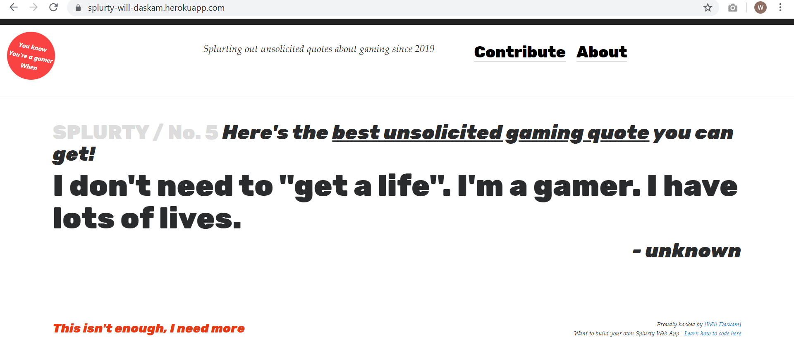

# Project 1: Splurty

Quote generator app that takes quotes about gaming submitted by users, stores them in a database, and then displays a random quote from the database on the home page. The app consists of the home page where the quotes are displayed, a link to a form for users to submit their own quotes, and an about page that gives more information about the app and who built it.

## Getting Started

These instructions will get you a copy of the project up and running on your local machine for development and testing purposes.

1. First clone the git repository, copy the url, and run 'git clone paste-url-here' in your coding environment. 

2. From here, you will need to run 'bundle install' and 'rake db:create' to install the necessary gems and create the initial databse respectively. Make sure to also run 'rake db:migrate' to ensure the database is up to date with all the migrations. 

3. Once the database is set up, in order to get the project running on your local machine you will first need to create an initial quote in the database. This can be done by using the 'rails console' command and running 'Quote.create(saying: 'quote', author: 'author')'. Once this is done, you should be able to successfully run the app on your local machine.

## Deployed Version of the App

https://splurty-will-daskam.herokuapp.com/

## Built With

* [Bootstrap](https://getbootstrap.com/) - The web framework used

* Ruby version: 2.5.5

## Author

* **Will Daskam** 

